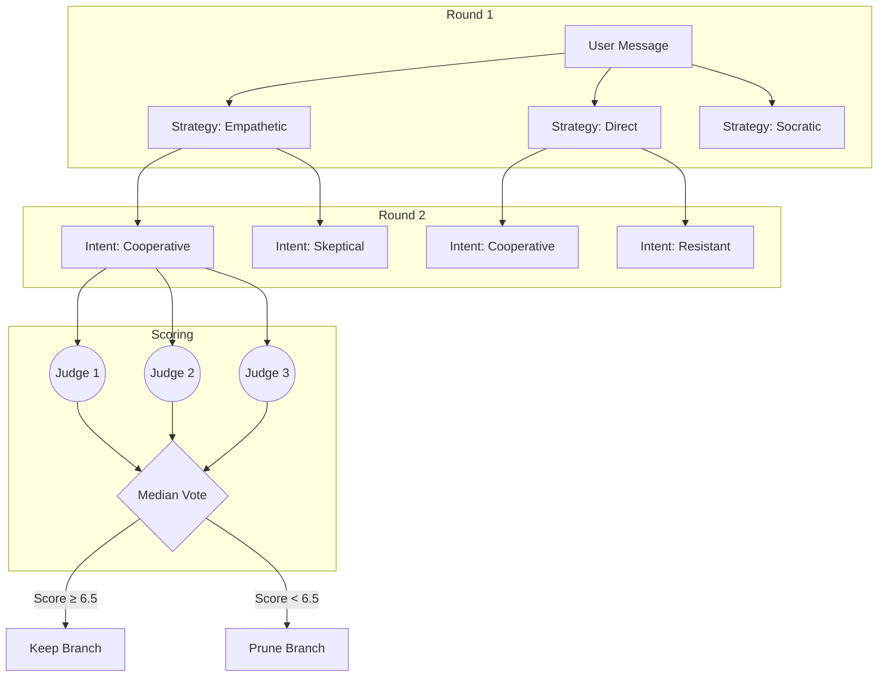
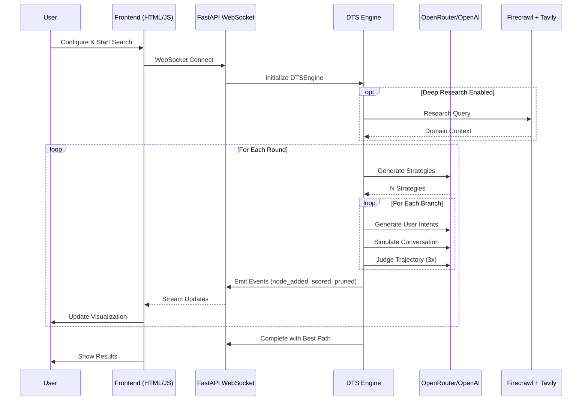
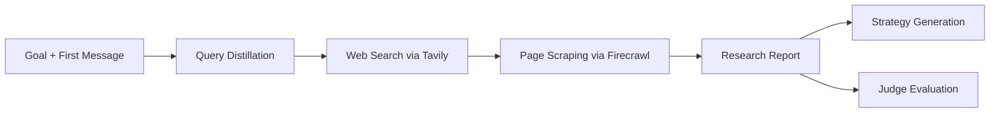

# Dialogue Tree Search (DTS)

[](https://www.python.org/downloads/)
[](https://opensource.org/licenses/Apache-2.0)
[](https://github.com/astral-sh/ruff)
[](https://github.com/astral-sh/uv)

**An LLM-powered Monte Carlo Tree Search engine for multi-turn conversation optimization.**

DTS explores conversation strategies in parallel, simulates diverse user reactions, scores trajectories with multi-judge consensus, and prunes underperformers—finding optimal dialogue paths that single-shot LLM responses miss.

---

## Table of Contents

- [Why DTS?](#why-dts)
- [How It Works](#how-it-works)
  - [The Algorithm](#the-algorithm)
  - [Parallel Beam Search](#parallel-beam-search)
  - [User Intent Forking](#user-intent-forking)
  - [Multi-Judge Scoring](#multi-judge-scoring)
  - [Scoring Modes](#scoring-modes-comparative-vs-absolute)
- [System Architecture](#system-architecture)
- [Prerequisites & API Keys](#prerequisites--api-keys)
- [Installation](#installation)
- [Quick Start](#quick-start)
- [Configuration](#configuration)
- [Deep Research Integration](#deep-research-integration)
- [API Reference](#api-reference)
- [Frontend Visualizer](#frontend-visualizer)
- [Project Structure](#project-structure)
- [Token Usage & Cost Management](#token-usage--cost-management)
- [Troubleshooting](#troubleshooting)
- [License](#license)

---

## Why DTS?

Standard LLMs generate responses one turn at a time, optimizing locally without considering long-term conversation outcomes. This leads to:

- **Myopic responses** that sound good but lead to dead ends
- **Single-path thinking** that misses better strategic approaches
- **Fragile strategies** that fail when users respond unexpectedly

DTS solves this by treating conversation as a **tree search problem**:

1. **Explore multiple strategies** in parallel (not just one response)
2. **Simulate diverse user reactions** (skeptical, enthusiastic, confused, etc.)
3. **Score complete trajectories** against your goal
4. **Prune bad paths early** to focus computation on promising directions

The result: dialogue strategies that are **robust**, **goal-oriented**, and **tested against varied user behaviors**.

---

## How It Works

### The Algorithm

DTS implements a parallel beam search with the following loop:

```
For each round:
    1. Generate N diverse conversation strategies
    2. For each strategy, simulate K user intent variants
    3. Roll out multi-turn conversations for each branch
    4. Score all trajectories with 3 independent judges
    5. Prune branches below threshold (median vote)
    6. Backpropagate scores up the tree
    7. Repeat with surviving branches
```

### Parallel Beam Search

Unlike traditional single-path generation, DTS maintains multiple conversation branches simultaneously:



**Key parameters:**
- `init_branches`: Number of initial strategies (default: 6)
- `turns_per_branch`: Conversation depth per branch (default: 5)
- `max_concurrency`: Parallel LLM calls (default: 16)

### User Intent Forking

Most dialogue systems assume a single "happy path" user response. DTS stress-tests strategies against **diverse user personas**:

| Emotional Tone | Cognitive Stance | Example Behavior |
|:---------------|:-----------------|:-----------------|
| `engaged` | `accepting` | Cooperative, follows suggestions |
| `skeptical` | `questioning` | Asks for evidence, challenges claims |
| `confused` | `exploring` | Needs clarification, misunderstands |
| `resistant` | `challenging` | Pushes back, disagrees |
| `anxious` | `withdrawing` | Hesitant, wants to end conversation |

Each strategy forks into K intent variants (default: 3), creating branches that prove robustness across user types.

**UserIntent structure:**
```python
UserIntent(
    id="skeptical_questioner",
    label="Skeptical Questioner",
    description="Demands evidence before accepting claims",
    emotional_tone="skeptical",      # How user feels
    cognitive_stance="questioning",  # How user thinks
)
```

### Multi-Judge Scoring

Each trajectory is evaluated by **3 independent LLM judges**. Scores are aggregated via **median voting** (robust to outlier judges):

```
Judge 1: 7.2  ─┐
Judge 2: 6.8  ─┼─► Median: 7.2  ─► Pass (≥ 6.5)
Judge 3: 8.1  ─┘
```

**Why 3 judges?**
- Single judge = high variance, easily gamed
- Median of 3 = robust to one outlier
- Majority vote determines pass/fail (2 of 3 must pass)

**Scoring criteria** (each 0-1, summed to 0-10):
- Goal achievement
- User need addressed
- Forward progress
- Clarity & coherence
- Appropriate tone
- Information accuracy
- Handling objections
- Building rapport
- Conversation flow
- Strategic effectiveness

### Scoring Modes: Comparative vs Absolute

DTS supports two evaluation modes:

| Mode | How It Works | Best For |
|:-----|:-------------|:---------|
| **Comparative** | Sibling branches force-ranked against each other | Sharp discrimination, finding the single best path |
| **Absolute** | Each branch scored independently (0-10) | Early pruning, filtering obviously bad paths |

**Comparative mode** (default):
```
Input: [Strategy A, Strategy B, Strategy C] (siblings)
Output: A=7.5, B=6.0, C=4.5 (forced ranking with 1.5-point gaps)
```

**Absolute mode**:
```
Input: Strategy A (evaluated alone)
Output: 3 judges → [7.2, 6.8, 8.1] → Median: 7.2
```

Use `scoring_mode="comparative"` when you need the best single answer.
Use `scoring_mode="absolute"` when filtering many branches quickly.

---

## System Architecture



### Component Overview

| Component | Location | Purpose |
|:----------|:---------|:--------|
| **DTSEngine** | `backend/core/dts/engine.py` | Main orchestrator, runs expand→score→prune loop |
| **StrategyGenerator** | `backend/core/dts/components/generator.py` | Creates strategies and user intents |
| **ConversationSimulator** | `backend/core/dts/components/simulator.py` | Runs multi-turn dialogue rollouts |
| **TrajectoryEvaluator** | `backend/core/dts/components/evaluator.py` | Multi-judge scoring with median aggregation |
| **DeepResearcher** | `backend/core/dts/components/researcher.py` | GPT-Researcher integration for context |
| **DialogueTree** | `backend/core/dts/tree.py` | Tree data structure with backpropagation |
| **LLM Client** | `backend/llm/client.py` | Provider-agnostic OpenAI-compatible wrapper |

---

## Prerequisites & API Keys

### Required Credentials

| Service | Environment Variable | Required | Purpose |
|:--------|:--------------------|:---------|:--------|
| **LLM Provider** | `OPENAI_API_KEY` | **Yes** | Strategy generation, simulation, and judging |
| **Web Scraping** | `FIRECRAWL_API_KEY` | For Deep Research | Scrapes web pages for research context |
| **Web Search** | `TAVILY_API_KEY` | For Deep Research | Searches the web for relevant sources |

### Getting API Keys

1. **OpenRouter** (recommended): [openrouter.ai/keys](https://openrouter.ai/keys)
   - Works with 100+ models (GPT-4, Claude, Gemini, open-source)
   - Pay-per-token, no subscriptions
   - Set `OPENAI_BASE_URL=https://openrouter.ai/api/v1`

2. **Firecrawl**: [firecrawl.dev](https://firecrawl.dev)
   - Required for `deep_research=True`
   - Handles JavaScript-rendered pages, anti-bot bypass

3. **Tavily**: [tavily.com](https://tavily.com)
   - Required for `deep_research=True`
   - AI-optimized web search API

> **Note:** Deep Research features require both Firecrawl and Tavily keys. Without them, set `deep_research=False` in your configuration.

### Optional Configuration

| Variable | Default | Description |
|:---------|:--------|:------------|
| `OPENAI_BASE_URL` | `https://openrouter.ai/api/v1` | LLM API endpoint |
| `LLM_NAME` | `z-ai/glm-4.7` | Default model for all phases |
| `FAST_LLM` | `openrouter:bytedance-seed/seed-1.6-flash` | Fast model for research |
| `SMART_LLM` | `openrouter:google/gemini-2.0-flash-001` | Smart model for complex tasks |
| `STRATEGIC_LLM` | `openrouter:minimax/minimax-m2.1` | Strategic reasoning model |
| `LLM_TIMEOUT` | `60` | Request timeout in seconds |
| `LLM_MAX_RETRIES` | `2` | Retry attempts on failure |
| `MAX_CONCURRENCY` | `16` | Parallel LLM call limit |

---

## Installation

**Requires Python 3.11+**

```bash
# Clone the repository
git clone https://github.com/MVPandey/DTS.git
cd DTS

# Install uv (fast Python package manager)
curl -LsSf https://astral.sh/uv/install.sh | sh

# Create virtual environment and install dependencies
uv venv .venv
source .venv/bin/activate  # Windows: .venv\Scripts\activate
uv pip install -e .
```

### Configure Environment

Create a `.env` file in the project root:

```env
# Required
OPENAI_API_KEY=sk-or-v1-your-openrouter-key

# Recommended (defaults shown)
OPENAI_BASE_URL=https://openrouter.ai/api/v1
LLM_NAME=z-ai/glm-4.7

# For Deep Research (optional but recommended)
FIRECRAWL_API_KEY=fc-your-firecrawl-key
TAVILY_API_KEY=tvly-your-tavily-key

# Deep Research Models
FAST_LLM=openrouter:bytedance-seed/seed-1.6-flash
SMART_LLM=openrouter:google/gemini-2.0-flash-001
STRATEGIC_LLM=openrouter:minimax/minimax-m2.1
```

---

## Quick Start

### Option 1: Using Start Scripts (Recommended)

The easiest way to start the server:

**Unix/macOS/Linux:**
```bash
# Start with Docker
./scripts/start_server.sh

# Start in development mode (hot reload)
./scripts/start_server.sh --dev

# Start without Docker (local Python)
./scripts/start_server.sh --local

# Stop the server
./scripts/start_server.sh --down
```

**Windows:**
```cmd
REM Start with Docker
scripts\start_server.bat

REM Start in development mode (hot reload)
scripts\start_server.bat --dev

REM Start without Docker (local Python)
scripts\start_server.bat --local

REM Stop the server
scripts\start_server.bat --down
```

### Option 2: Using Docker Compose Directly

```bash
# Start the server (production)
docker-compose up -d dts-server

# Start in development mode with hot reload
docker-compose --profile dev up dts-server-dev

# View logs
docker-compose logs -f

# Stop and remove containers
docker-compose down

# Rebuild after code changes
docker-compose up -d --build dts-server
```

### Option 3: Manual Uvicorn Start

```bash
# Activate virtual environment
source .venv/bin/activate  # Windows: .venv\Scripts\activate

# Set PYTHONPATH
export PYTHONPATH=$(pwd)  # Windows: set PYTHONPATH=%cd%

# Start server
uvicorn backend.api.server:app --host localhost --port 8000 --reload --log-level info
```

### Option 4: VSCode Debugger

The project includes VSCode launch configurations for debugging:

1. Open the project in VSCode
2. Go to **Run and Debug** (Ctrl+Shift+D / Cmd+Shift+D)
3. Select a configuration from the dropdown:

| Configuration | Description |
|:--------------|:------------|
| **Debug DTS Server** | Start the API server with debugger attached |
| **Debug Current Python File** | Debug the currently open file |
| **Attach to Remote Debugpy** | Attach to a running debugpy server (port 5678) |

4. Press F5 or click the green play button

**VSCode Launch Configuration** (`.vscode/launch.json`):
```json
{
  "name": "Debug DTS Server",
  "type": "debugpy",
  "request": "launch",
  "module": "uvicorn",
  "args": [
    "backend.api.server:app",
    "--host", "localhost",
    "--port", "8000",
    "--reload",
    "--log-level", "info"
  ],
  "env": { "PYTHONPATH": "${workspaceFolder}" },
  "envFile": "${workspaceFolder}/.env"
}
```

### Option 5: Python Script (Headless)

For programmatic use without the web interface:

```python
import asyncio
from backend.core.dts import DTSConfig, DTSEngine
from backend.llm.client import LLM
from backend.utils.config import config

async def main():
    # Initialize LLM client
    llm = LLM(
        api_key=config.openai_api_key,
        base_url=config.openai_base_url,
        model="z-ai/glm-4.7",
    )

    # Configure the search
    dts_config = DTSConfig(
        goal="Negotiate a 15% discount on enterprise software",
        first_message="Hi, I'd like to discuss our renewal pricing.",
        init_branches=6,           # 6 initial strategies
        turns_per_branch=5,        # 5-turn conversations
        user_intents_per_branch=3, # Fork into 3 user types
        scoring_mode="comparative", # Force-rank siblings
        prune_threshold=6.5,       # Minimum score to survive
        deep_research=True,        # Enable research context
    )

    # Run the search
    engine = DTSEngine(llm=llm, config=dts_config)
    result = await engine.run(rounds=2)

    # Output results
    print(f"Best Score: {result.best_score:.1f}/10")
    print(f"Branches Explored: {len(result.all_nodes)}")
    print(f"Branches Pruned: {result.pruned_count}")

    # Save full results
    result.save_json("output.json")

if __name__ == "__main__":
    asyncio.run(main())
```

Or run the included example:

```bash
python main.py
```

### Accessing the Application

Once the server is running:

| Resource | URL |
|:---------|:----|
| **API** | http://localhost:8000 |
| **API Docs (Swagger)** | http://localhost:8000/docs |
| **API Docs (ReDoc)** | http://localhost:8000/redoc |
| **Frontend** | Open `frontend/index.html` in your browser |

---

## Configuration

### DTSConfig Parameters

| Parameter | Type | Default | Description |
|:----------|:-----|:--------|:------------|
| `goal` | `str` | *required* | What you want the conversation to achieve |
| `first_message` | `str` | *required* | Opening user message |
| `init_branches` | `int` | `6` | Number of initial strategies to generate |
| `turns_per_branch` | `int` | `5` | Conversation depth (assistant+user turns) |
| `user_intents_per_branch` | `int` | `3` | User persona variants per strategy |
| `scoring_mode` | `str` | `"comparative"` | `"comparative"` or `"absolute"` |
| `prune_threshold` | `float` | `6.5` | Minimum score to survive (0-10 scale) |
| `keep_top_k` | `int \| None` | `None` | Hard cap on survivors per round |
| `min_survivors` | `int` | `1` | Minimum branches to keep (floor) |
| `deep_research` | `bool` | `False` | Enable GPT-Researcher integration |
| `max_concurrency` | `int` | `16` | Parallel LLM call limit |
| `temperature` | `float` | `0.7` | Generation temperature |
| `judge_temperature` | `float` | `0.3` | Judge temperature (lower = more consistent) |

### Per-Phase Model Overrides

Use different models for different phases to optimize cost/quality:

```python
DTSConfig(
    goal="...",
    first_message="...",
    strategy_model="anthropic/claude-3-opus",  # Best for strategy
    simulator_model="openai/gpt-4o-mini",       # Fast for simulation
    judge_model="google/gemini-1.5-pro",        # Balanced for judging
)
```

---

## Deep Research Integration

DTS integrates [GPT-Researcher](https://github.com/assafelovic/gpt-researcher) to gather domain context before generating strategies.

### How It Works



1. **Query Distillation**: LLM converts goal into focused research query
2. **Web Search**: Tavily finds relevant sources
3. **Scraping**: Firecrawl extracts content (handles JS, anti-bot)
4. **Report**: GPT-Researcher synthesizes findings
5. **Injection**: Report fed to strategy generator and judges

### Configuration

```python
DTSConfig(
    goal="Explain quantum computing to a 10-year-old",
    first_message="What's quantum computing?",
    deep_research=True,  # Enable research
)
```

### Caching

Research results are cached by `SHA256(goal + first_message)` in `.cache/research/`. Subsequent runs with the same inputs skip the research phase.

### Required API Keys

| Service | Purpose | Get Key |
|:--------|:--------|:--------|
| **Firecrawl** | Web page scraping | [firecrawl.dev](https://firecrawl.dev) |
| **Tavily** | Web search | [tavily.com](https://tavily.com) |

> **Cost Note:** Deep research adds external API costs beyond LLM tokens. Monitor usage during development.

---

## API Reference

### WebSocket Endpoint

**URL:** `ws://localhost:8000/ws`

### Starting a Search

```json
{
  "type": "start_search",
  "config": {
    "goal": "Your conversation goal",
    "first_message": "Opening user message",
    "init_branches": 6,
    "turns_per_branch": 5,
    "user_intents_per_branch": 3,
    "scoring_mode": "comparative",
    "prune_threshold": 6.5,
    "rounds": 2,
    "deep_research": false
  }
}
```

### Event Stream

The server emits real-time events as the search progresses:

| Event | Description | Data |
|:------|:------------|:-----|
| `search_started` | Search initialized | `{goal, config}` |
| `phase` | Lifecycle update | `{phase, message}` |
| `strategy_generated` | New strategy created | `{tagline, description}` |
| `intent_generated` | User intent created | `{label, emotional_tone}` |
| `research_log` | Deep research progress | `{message}` |
| `round_started` | Round begins | `{round, total_rounds}` |
| `node_added` | Branch created | `{id, strategy, intent}` |
| `node_updated` | Branch scored | `{id, score, passed}` |
| `nodes_pruned` | Branches removed | `{ids, reasons}` |
| `token_update` | Token usage snapshot | `{totals}` |
| `complete` | Search finished | `{best_node, all_nodes}` |
| `error` | Error occurred | `{message}` |

### REST Endpoints

FastAPI auto-generates OpenAPI docs at `http://localhost:8000/docs`.

---

## Frontend Visualizer

The included frontend (`frontend/index.html`) provides real-time visualization:

### Features

- **Configuration Panel**: Set goal, parameters, and models
- **Live Progress**: Watch strategies generate and branches expand
- **Branch Browser**: Explore all trajectories with full transcripts
- **Score Details**: See individual judge scores and critiques
- **Token Tracking**: Monitor costs by phase and model
- **Export**: Download results as JSON

### Running the Frontend

1. Start the API server:
   ```bash
   uvicorn backend.api.server:app --port 8000
   ```

2. Open `frontend/index.html` in a browser

3. Configure your search and click "Start Search"

---

## Project Structure

```
DTS/
├── backend/
│   ├── api/
│   │   ├── server.py          # FastAPI WebSocket server
│   │   └── schemas.py         # Pydantic request/response models
│   ├── core/
│   │   ├── dts/
│   │   │   ├── engine.py      # Main DTSEngine orchestrator
│   │   │   ├── config.py      # DTSConfig dataclass
│   │   │   ├── types.py       # Core data models
│   │   │   ├── tree.py        # DialogueTree structure
│   │   │   ├── aggregator.py  # Median vote aggregation
│   │   │   ├── retry.py       # Shared retry logic
│   │   │   └── components/
│   │   │       ├── generator.py   # Strategy & intent generation
│   │   │       ├── simulator.py   # Conversation rollouts
│   │   │       ├── evaluator.py   # Multi-judge scoring
│   │   │       └── researcher.py  # GPT-Researcher integration
│   │   └── prompts.py         # All prompt templates
│   ├── llm/
│   │   ├── client.py          # OpenAI-compatible LLM client
│   │   ├── types.py           # Message, Completion, Usage
│   │   ├── errors.py          # Custom exception types
│   │   └── tools.py           # Tool calling support
│   ├── services/
│   │   └── search_service.py  # API service layer
│   └── utils/
│       └── config.py          # Pydantic settings from .env
├── frontend/
│   ├── index.html             # Single-page visualizer
│   └── app.js                 # WebSocket client & UI logic
├── scripts/
│   ├── start_server.sh        # Unix/macOS start script
│   └── start_server.bat       # Windows start script
├── gpt-researcher/            # GPT-Researcher submodule
├── .vscode/
│   └── launch.json            # VSCode debug configurations
├── Dockerfile                 # Container image definition
├── docker-compose.yml         # Multi-container orchestration
├── main.py                    # Example script
├── pyproject.toml             # Project metadata & dependencies
├── CLAUDE.md                  # Developer instructions
└── README.md                  # This file
```

### Key Data Models

```python
# Strategy for conversation approach
Strategy(tagline="Empathetic Listener", description="Validate feelings first...")

# User persona for intent forking
UserIntent(
    id="skeptic",
    label="Skeptical Questioner",
    emotional_tone="skeptical",
    cognitive_stance="questioning",
)

# Tree node with conversation state
DialogueNode(
    id="uuid",
    strategy=Strategy(...),
    user_intent=UserIntent(...),
    messages=[Message(role="user", content="...")],
    stats=NodeStats(aggregated_score=7.2),
)

# Final result
DTSRunResult(
    best_node_id="uuid",
    best_score=8.1,
    best_messages=[...],
    all_nodes=[...],
    token_usage={...},
)
```

---

## Token Usage & Cost Management

### Understanding Costs

DTS is token-intensive due to parallel exploration. A typical run involves:

```
Cost Formula ≈ Branches × Intents × Turns × (Generation + 3×Judging)

Example: 6 branches × 3 intents × 5 turns × 4 calls = 360 LLM calls
```

### Token Breakdown by Phase

| Phase | % of Tokens | Purpose |
|:------|:------------|:--------|
| Strategy Generation | ~10% | Creating initial approaches |
| Intent Generation | ~5% | Generating user personas |
| User Simulation | ~30% | Simulating user responses |
| Assistant Simulation | ~25% | Generating assistant replies |
| Judging | ~30% | 3 judges per trajectory |

### Cost Optimization Strategies

1. **Raise `prune_threshold`**: Aggressively cull bad branches (6.5 → 7.0)
2. **Set `keep_top_k`**: Hard cap on survivors (e.g., `keep_top_k=3`)
3. **Lower `turns_per_branch`**: Shorter conversations (5 → 3)
4. **Disable forking**: Set `user_intents_per_branch=1`
5. **Use fast models**: Cheaper models for simulation, expensive for judging
6. **Fewer rounds**: Start with 1 round, add more if needed

### Monitoring Usage

The engine tracks tokens per phase and model:

```python
result = await engine.run(rounds=2)
print(result.token_usage)
# {
#   "total_input_tokens": 45000,
#   "total_output_tokens": 12000,
#   "total_cost_usd": 0.42,
#   "by_phase": {...},
#   "by_model": {...},
# }
```

---

## Troubleshooting

### Common Errors

| Error | Cause | Solution |
|:------|:------|:---------|
| `AuthenticationError` | Invalid API key | Check `OPENAI_API_KEY` in `.env` |
| `RateLimitError` | Too many requests | Lower `max_concurrency`, add delays |
| `ContextLengthError` | Conversation too long | Reduce `turns_per_branch` |
| `ValueError: FIRECRAWL_API_KEY required` | Missing research key | Add key or set `deep_research=False` |
| `JSONParseError` | LLM returned invalid JSON | Retry usually fixes; check model quality |
| `ServerError (5xx)` | Provider issues | Automatic retry with backoff |

### Debug Mode

Enable verbose logging:

```env
DEBUG=true
LOGGING_LEVEL=DEBUG
```

### Testing Without Deep Research

If you don't have Firecrawl/Tavily keys:

```python
DTSConfig(
    goal="...",
    first_message="...",
    deep_research=False,  # Disable research
)
```

---

## License

Apache License 2.0 — see [LICENSE](LICENSE).

---

## Contributing

Contributions welcome! Please read [CONTRIBUTING.md](CONTRIBUTING.md) before submitting PRs.

## Acknowledgments

- [GPT-Researcher](https://github.com/assafelovic/gpt-researcher) for deep research capabilities
- [OpenRouter](https://openrouter.ai) for multi-model API access
- [Firecrawl](https://firecrawl.dev) for web scraping
- [Tavily](https://tavily.com) for AI-optimized search
